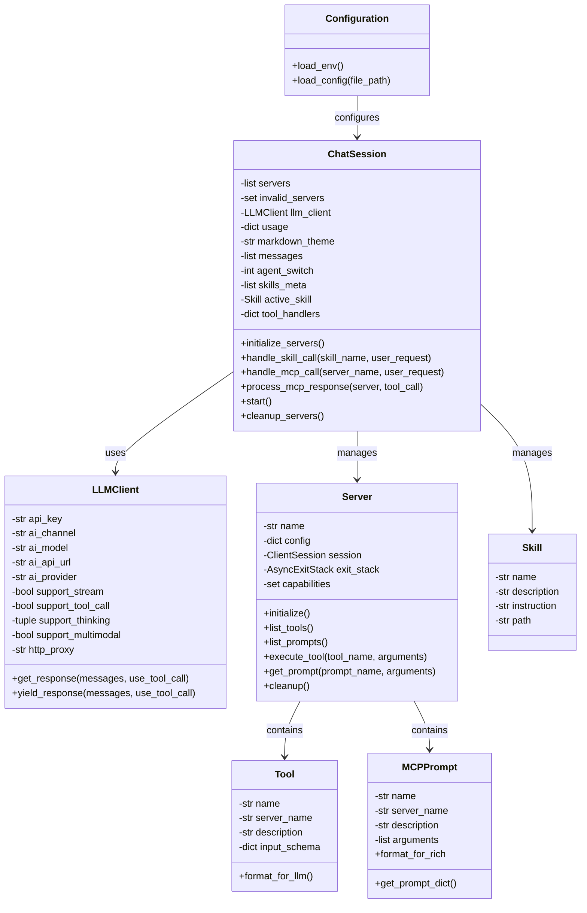
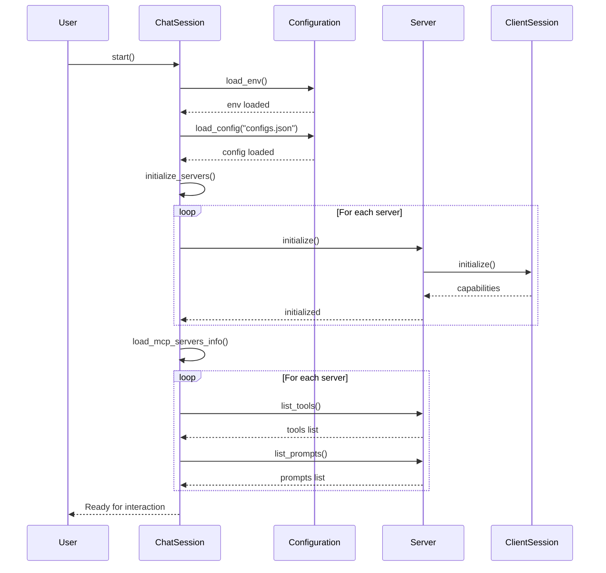
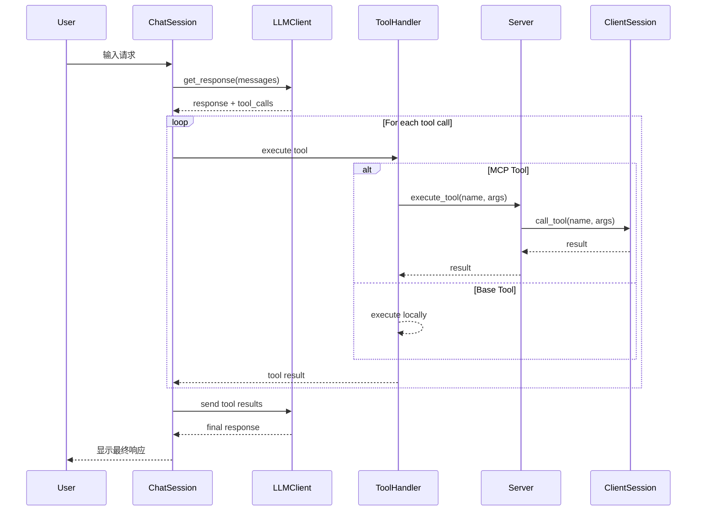
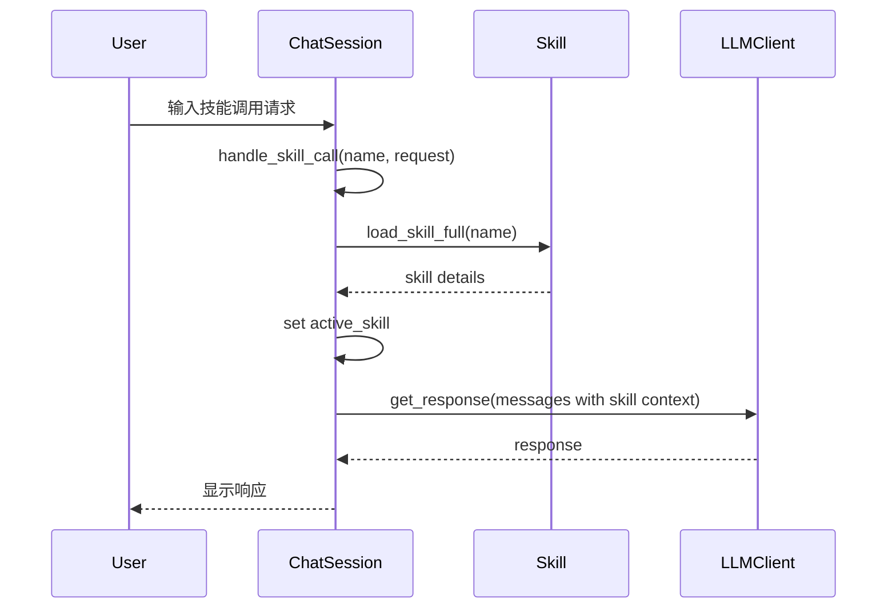
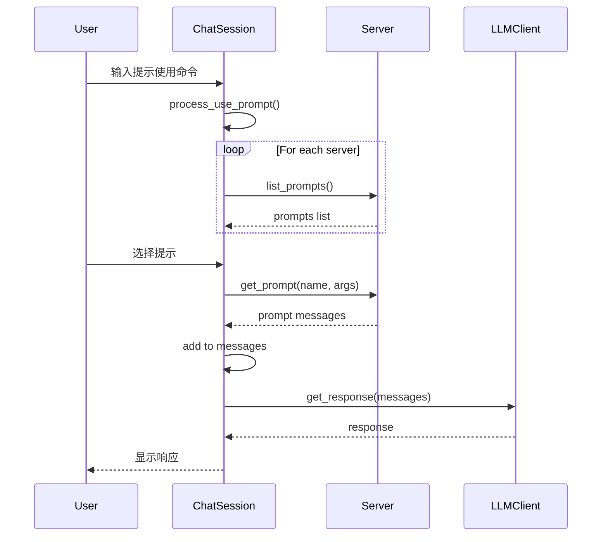

## 大体介绍
这个是小型的龙虾客户端，主要兼容openai的api的模型，部分代码为AI生成。
 - 在`configs.json`中配置了api_key和api_url，及mcp服务的地址。
 - mcp服务配置项中有特殊项`when_to_use`，因为本客户端针对MCP也做了“渐进式披露”处理，需要你维护好，便于大模型准确选择使用
 - 输入`/`可以列出各种命令
 - 在`skills/`文件夹下，可以添加各种技能
 - 在`workspace/`文件夹是各种工作目录，下面可以添加一个`memory.md`, 写入用户的工具调用习惯

## 安装
python >= 3.13  
`pip install -r requirements.txt`

## 类图

## 时序图

### 1. 初始化流程

### 2. 工具调用流程

### 3. 技能调用流程

### 4. MCP提示使用流程

## 关键交互说明

1. **初始化阶段**：
   - ChatSession 从配置文件加载LLM模型和MCP服务器配置
   - 初始化所有可用的MCP服务器连接
   - 加载可用的技能列表

2. **工具调用阶段**：
   - LLMClient 识别需要调用工具
   - ChatSession 解析工具调用参数
   - 通过对应的 Server 执行工具
   - 将工具结果返回给LLM继续处理

3. **技能系统**：
   - 技能存储在 `skills/` 目录下
   - 每个技能包含 SKILL.md 文件描述
   - 激活技能后，LLM会遵循技能指令处理请求

4. **多模态支持**：
   - 支持上传图片进行对话
   - 图片转换为base64格式发送给支持多模态的LLM

